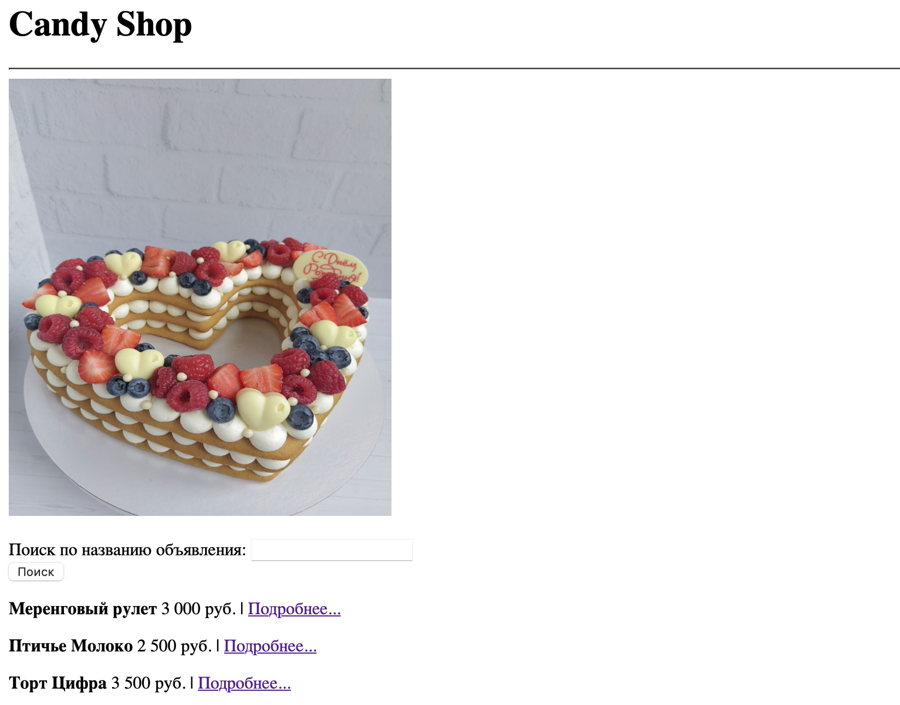
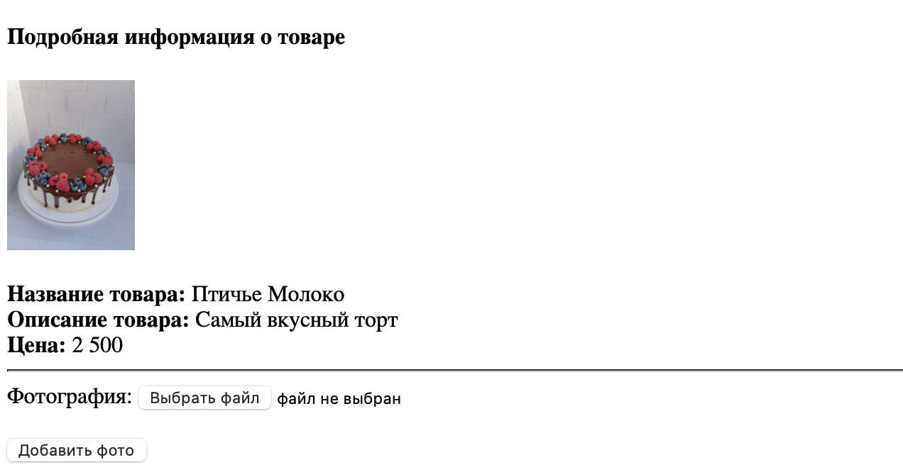

# Candy Shop V1.0


## Введение
В данном проекте я реализовал свой сайт для магазина сладостей с использованием технологий Spring Boot и PostgreSQL.
Программа написана в среде разработке IntelliJ IDEA CE.

Сущностями в этой программе являются объекты Product и Image, каждый из которых
хранится в базе данных и использует свой JPA репозиторий для работы с БД.
Класс ProductService определяет логику работы приложения: добавление товара, добавление фотографий к товару и удаление продукта
Классы ProductController и ImageController - это связующее звено между Java кодом и http запросами. Все это реализовано в первой версии моего сайта.

## Возможности

1. Создание нового товара с фотографией

2. Добавление фотографий к существующему товару

3. Удаление товара

## Установка
Для запуска проекта вам понадобятся:
- IntellijIDEA CE
- PostgreSQL и pgAdmin - в нем создать новую схему с названием <candyshop>

Для клонирования репозитория с GitHub:
```dtd
git clone https://github.com/Pelmeshka127/CandyShop.git
```
Откройте проект в Intellij и запустите его
Откройте браузер и введите http://localhost:8080